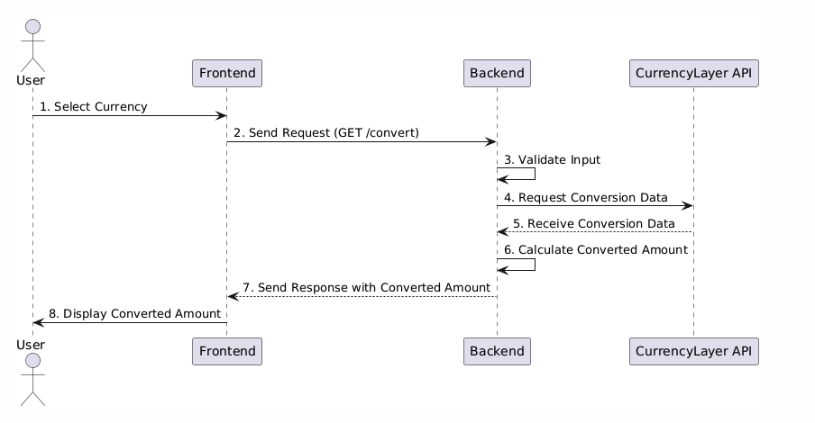

# Integrasi Currency Conversion pada Project `warung_postgre`

## 1. Pengantar
`warung_postgre` adalah project awal yang akan diimplementasikan dengan integrasi 3rd Party API untuk **Currency Conversion**. 
(https://apilayer.com/marketplace/fixer-api#documentation-tab)

## 2. Tujuan Integrasi
Tujuan dari integrasi ini adalah untuk menyediakan fitur tambahan yang memungkinkan pengguna untuk melihat harga produk dalam berbagai mata uang. Ini sangat berguna jika Anda memiliki pengguna atau pelanggan dari berbagai negara yang ingin melihat harga produk dalam mata uang lokal mereka.

## 3. Flow Pengguna

### **User:**
Pengguna memulai interaksi dengan memilih mata uang di antarmuka frontend.

### **Frontend:**
Setelah pengguna memilih mata uang, frontend mengirimkan permintaan GET ke backend pada endpoint `/convert` dengan parameter `from`, `to`, dan `amount`.

### **Backend:**
- Backend menerima permintaan dan memvalidasi input yang diterima.
- Jika valid, backend membuat permintaan HTTP ke CurrencyLayer API untuk mendapatkan data konversi mata uang.
- Setelah menerima respons dari API, backend menghitung jumlah yang telah dikonversi.
- Backend mengirimkan respons ke frontend dengan jumlah yang telah dikonversi.

### **CurrencyLayer API:**
Menyediakan data nilai tukar yang dibutuhkan backend untuk melakukan konversi.

### **Frontend:**
Menampilkan jumlah yang telah dikonversi kepada pengguna.
